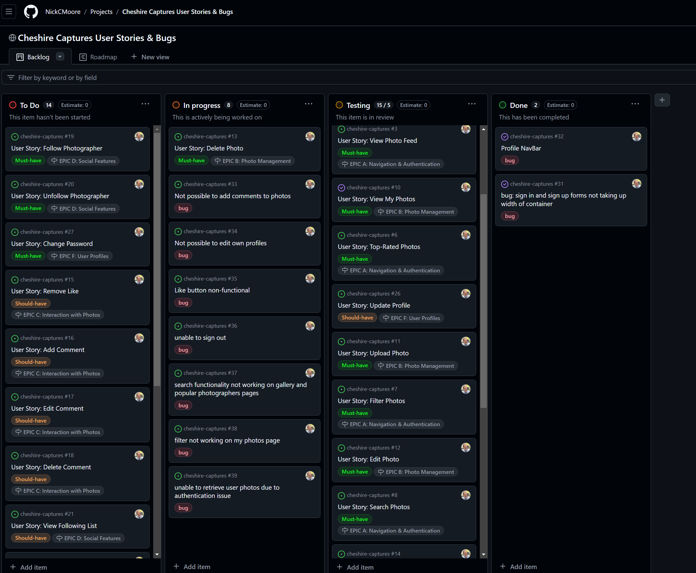

# **Cheshire Captures API**

## Table of Contents

- [Project](#project)
  * [Objective](#objective)
  * [Links to Deployed Project](#links-to-deployed-project)
- [Project Structure](#project-structure)
  * [Developer User Stories](#developer-user-stories)
    + [Profiles](#profiles)
    + [Photos](#photos)
    + [Comments](#comments)
    + [Likes](#likes)
    + [Followers](#followers)
    + [Search and Filter](#search-and-filter)
    + [Ratings and Reviews](#ratings-and-reviews)
- [Database Design](#database-design)
  * [Models](#models)
- [Agile Workflow](#agile-workflow)
  * [Github Project Board](#github-project-board)
- [Testing](#testing)
- [Deployment](#deployment)
- [Credits](#credits)

# **Project**

## Objective

**Cheshire Captures API** provides a backend database to manage user profiles, photo uploads, comments, likes, follows, and reviews for the Cheshire Captures platform. The API allows photographers and enthusiasts to interact with each other by sharing their work, following profiles, leaving comments, and rating photos.

The API includes search and filter functionality to enhance user experience, enabling users to easily find photographers or photos of interest.

## Links to Deployed Project

  + The project is deployed on Heroku: [Deployed Cheshire Captures API](https://cheshire-captures-backend-084aac6d9023.herokuapp.com/)
  + The front-end of the project is available at: [Cheshire Captures Front End](https://cheshire-captures-4a500dc7ab0a.herokuapp.com/)

## Project Structure

The structure of this project follows the **Code Institute DRF Walkthrough** for backend API development and the **Moments Walkthrough** for building a React front-end. Additional custom models and logic have been developed to tailor this platform to its unique purpose of sharing and showcasing photography.

## Developer User Stories

### Profiles

- As a user, I can create a profile upon registration, so that my profile is automatically generated and displayed.
- As a user, I can view all profiles to discover photographers on the platform.
- As a user, I can follow/unfollow other profiles to stay updated on their latest photos.
- As a user, I can edit my profile to update my bio, profile picture, and social links.

### Photos

- As a user, I can upload photos, so that they are displayed in the gallery.
- As a user, I can view all photos in the gallery to discover new work.
- As a user, I can search for specific photos by keywords or photographer names.
- As a user, I can filter photos by category to find photos related to my interests.

### Comments

- As a user, I can leave comments on photos to engage with the photographer's work.
- As a user, I can edit or delete my comments.
- As a user, I can view all comments on a specific photo to see what others are saying.

### Likes

- As a user, I can like photos to show appreciation for the content.
- As a user, I can remove my like if I change my mind.

### Followers

- As a user, I can follow/unfollow photographers to keep up with their work.
- As a user, I can view a list of all the users I follow.

### Search and Filter

- As a user, I can search for photos or photographers by keyword to find content that interests me.
- As a user, I can filter photos by category to narrow down my search results.

### Ratings and Reviews

- As a user, I can rate a photo from 1 to 5 stars to express my opinion on its quality.
- As a user, I can leave a review with a star rating for photos.

## Database Design

### Models

The following models have been developed for the Cheshire Captures API:

- **User**: Extends Django's User model.
- **Profile**: Automatically created upon user registration to store additional user information like bio and profile picture.
- **Photo**: Stores information related to each uploaded image.
- **Comment**: Allows users to comment on photos.
- **Like**: Tracks users who like specific photos.
- **Follow**: Handles the follower relationship between profiles.
- **Rating**: Stores star ratings for photos.
- **Review**: Stores user reviews with star ratings for photos.

The relationships between these models are illustrated in the following entity relationship diagram:


## Features

### Homepage

The API's root route welcomes users and provides links to the main API endpoints.

### Profile Data

Users can view and update their profiles. Profile data includes the user’s bio, profile picture, followers, and more.

### Photos Data

Users can upload, view, edit, and delete their photos. The gallery allows all users to browse the photos shared by the community.

### Comments Data

Users can view, add, edit, and delete comments on photos to engage with photographers and their work.

### Likes Data

Users can like photos to show appreciation and remove likes if desired.

### Followers Data

Users can follow/unfollow other photographers, helping them keep up with their favorite photographers' work.

### Ratings and Reviews Data

Users can rate and review photos to provide feedback to photographers. These ratings contribute to the "Top-Rated Photos" section.

## Agile Workflow

### GitHub Project Board

The project was managed using GitHub’s Kanban board to organize tasks based on user stories and development goals. Each feature was tracked and prioritized using the MoSCoW method.





## Testing

Please refer to the [Testing Documentation](TESTING.md) for more detailed information on the testing process.

## Technologies Used

### Backend

- **Django (v5.1.2)**: The core Python web framework used to develop the backend of the application, enabling rapid and secure development.
- **Django REST Framework (v3.14.0)**: Provides powerful tools to create the RESTful API that connects the backend to the React frontend.
- **PostgreSQL**: A relational database system used to manage all data related to users, photos, comments, and interactions.
- **Cloudinary (v1.41.0)**: A cloud-based service used for storing and managing image uploads, making it easier to serve user-uploaded media across the platform.
- **Heroku**: The cloud platform used for deploying the backend of the project, ensuring scalability and reliable hosting.
- **Gunicorn (v20.1.0)**: A Python WSGI HTTP server used to run the Django application on Heroku in production.
- **Whitenoise (v6.7.0)**: Ensures efficient serving of static files directly from the Django application in production environments.

## API Endpoints

### Authentication

- **Login**: `POST /dj-rest-auth/login/`
- **Logout**: `POST /dj-rest-auth/logout/`
- **Registration**: `POST /dj-rest-auth/registration/`
- **Resend Registration Email**: `POST /dj-rest-auth/registration/resend-email/`
- **Verify Registration Email**: `POST /dj-rest-auth/registration/verify-email/`
- **Password Change**: `POST /dj-rest-auth/password/change/`
- **Password Reset**: `POST /dj-rest-auth/password/reset/`
- **Password Reset Confirm**: `POST /dj-rest-auth/password/reset/confirm/`
- **Token Refresh**: `POST /dj-rest-auth/token/refresh/`
- **Token Verify**: `POST /dj-rest-auth/token/verify/`
- **User Details**: `GET /dj-rest-auth/user/`
- **Update User**: `PUT /dj-rest-auth/user/`
- **Partial Update User**: `PATCH /dj-rest-auth/user/`

### Photos

- **Get All Photos**: `GET /api/photos/photos/`
- **Create a Photo**: `POST /api/photos/photos/`
- **Get My Photos**: `GET /api/photos/photos/my_photos/`
- **Top-Rated Photos**: `GET /api/photos/photos/top-rated/`
- **Photo Details**: `GET /api/photos/photos/{id}/`
- **Edit Photo**: `PUT /api/photos/photos/{id}/`
- **Partial Update Photo**: `PATCH /api/photos/photos/{id}/`
- **Delete Photo**: `DELETE /api/photos/photos/{id}/`
- **Rate Photo**: `POST /api/photos/photos/{id}/rate/`
- **Get Photo Ratings**: `GET /api/photos/photos/{id}/ratings/`
- **Like Photo**: `POST /api/photos/photos/{id}/like/`
- **Unlike Photo**: `POST /api/photos/photos/{id}/unlike/`
- **Get Photo Comments**: `GET /api/photos/photos/{id}/comments/`
- **Create Photo Comment**: `POST /api/photos/photos/{id}/comments/`
- **Get Photo Tags**: `GET /api/photos/tags/`
- **Create Photo Tag**: `POST /api/photos/tags/`

### Comments

- **Get All Comments**: `GET /api/photos/comments/`
- **Create a Comment**: `POST /api/photos/comments/`
- **Delete a Comment**: `DELETE /api/photos/comments/{id}/`

### Follows

- **Get All Follows**: `GET /api/photographers/follows/`
- **Follow a Photographer**: `POST /api/photographers/follows/`
- **Unfollow a Photographer**: `POST /api/photographers/follows/{id}/unfollow/`

### Photographers

- **Get All Photographers**: `GET /api/photographers/photographers/`
- **Photographer Details**: `GET /api/photographers/photographers/{id}/`
- **Update Photographer**: `PUT /api/photographers/photographers/{id}/`
- **Partial Update Photographer**: `PATCH /api/photographers/photographers/{id}/`
- **Follow a Photographer**: `POST /api/photographers/photographers/{id}/follow/`
- **Unfollow a Photographer**: `DELETE /api/photographers/photographers/{id}/follow/`
- **Get Photographer's Followers**: `GET /api/photographers/photographers/{id}/followers/`
- **Top Photographers**: `GET /api/photographers/top-photographers/`

### Messages

- **Get All Messages**: `GET /api/messages/messages/`
- **Create a Message**: `POST /api/messages/messages/`
- **Message Details**: `GET /api/messages/messages/{id}/`
- **Update Message**: `PUT /api/messages/messages/{id}/`
- **Partial Update Message**: `PATCH /api/messages/messages/{id}/`
- **Delete Message**: `DELETE /api/messages/messages/{id}/`


## Backend Architecture

### Models

- **User**: Includes user information and authentication.
- **Photographer**: Extends the user model with profile-specific data.
- **Photo**: Represents uploaded photos, with attributes like title, description, image URL, and ratings.
- **Comment**: Represents user comments on photos.
- **Like**: Stores user likes on photos.
- **Follow**: Manages following relationships between photographers.

### Pagination

- **StandardResultsSetPagination**: Used for paginating results in various endpoints.

### Filtering & Searching

- Utilises `django-filters` for filtering by category, tags, and date ranges.
- Supports search queries for photo titles, descriptions, and photographers.

### Routing

- Uses `react-router-dom` for routing:
  - `"/"`: Home page.
  - `"/signin"`: Sign in page.
  - `"/signup"`: Registration page.
  - `"/gallery"`: Displays all photos.
  - `"/photos/:id"`: Photo details page.
  - `"/profile/:id"`: User profile page.
  - `"/profile/:id/edit"`: Edit profile page.
  - `"/my-photos"`: View and manage photos uploaded by the user.
  - `"/top-rated"`: Displays top-rated photos.
  - `"/popular-photographers"`: View popular photographers.
  - `"/search"`: Search for photos or photographers by keyword.
  - `"/comments/:photoId"`: View comments for a specific photo.
  - `"/messages"`: View all messages.
  - `"/messages/:id"`: View specific message details.

# Deployment Guide

## Deployment to Heroku

Once you have set up a new Gitpod workspace and your project is ready, follow the steps below to deploy your application to Heroku.

### Step 1: Create a New Heroku App

1. Log in to your Heroku account.
2. On the dashboard, click the **Create New App** button.
3. Choose a **unique name** for your app that relates to your project.
4. Select the appropriate **region** based on your location.
5. Click **Create App** to proceed.

### Step 2: Deploy the Application

1. After creating the app, navigate to the **Deploy** tab in Heroku.
2. In the **Deployment method** section, choose **GitHub**.
3. Connect your GitHub account (if not already connected) and find your **project repository**.
4. Once connected, select the branch you wish to deploy (usually `main` or `master`) and click **Deploy Branch**.
5. Heroku will now start building your application. Wait for the **build succeeded** message.
6. After the build is complete, click **Open App** to view your application in the browser.

## Connecting React Frontend to the API Backend

Once the basic deployment is complete, follow these steps to connect your React frontend to your API backend for seamless data exchange.

### Step 1: Set Environment Variables in Heroku

1. In your Heroku dashboard, navigate to your **API application's settings**.
2. Scroll down to the **Config Vars** section and click **Reveal Config Vars**.
3. Add the following config variables:
   - **CLIENT_ORIGIN**: This should be the URL of your deployed React application (e.g., `https://myapp-react.herokuapp.com`).
   - **CLIENT_ORIGIN_DEV**: This is the URL of your Gitpod workspace (e.g., `https://3000-yourproject.gitpod.io`). Make sure to remove any trailing slashes from the URL.


   > **Note:** Gitpod occasionally changes this URL, so make sure to update this config variable as needed during development.

### Step 2: Set Up Axios in React

1. In your React frontend Gitpod workspace, open a terminal and install Axios by running:

```
npm install axios
```

2. Create a folder named API and inside it, create a file called axiosDefaults.js.

3. In axiosDefaults.js, set up Axios defaults by importing Axios and configuring the base URL for your API:

```
import axios from 'axios';

axios.defaults.baseURL = 'https://your-api-backend.herokuapp.com/';
axios.defaults.headers.post['Content-Type'] = 'multipart/form-data';
axios.defaults.withCredentials = true;
```

Note: Replace 'https://your-api-backend.herokuapp.com/' with the actual URL of your deployed API project.

4. To ensure Axios is set up across your React app, import this file into your main App.js file:

```
import './API/axiosDefaults';
```

5. Now, your React frontend is ready to communicate with the API backend for sending and receiving data, including handling images with the correct content type.

## Forking the Project Repository

If you'd like to make an independent copy of the project repository, you can fork it on GitHub. Forking allows you to make changes to the repository without affecting the original.

### Steps to Fork a Repository:

1. Log into your GitHub account and navigate to the repository you want to fork.
2. In the top-right corner of the repository page, click the **Fork** button.
3. GitHub will create a copy of the original repository under your account, allowing you to modify it independently.
4. Once forked, you can make changes to your copy without impacting the original project.

## Cloning the Project Repository

A Git clone creates a local copy of a GitHub repository on your machine that stays linked to the original repository. This allows you to pull updates and push changes as needed.

### Steps to Clone a Repository:

1. On the GitHub repository page, click the **Code** button.
2. In the dropdown, select **Clone** and choose your preferred method:
   - **HTTPS**: Copy the HTTPS link to clone the repository.
   - **SSH**: Use SSH for a secure connection if you have it set up.
3. Open a terminal and run the following command to clone the repository:

```
git clone https://github.com/your-username/repository-name.git
```

Note: Replace your-username and repository-name with your GitHub username and the repository name.

4. After cloning, navigate into the project directory:

```
cd repository-name
```
5. You can now make changes to the project locally. Any updates you make can be pushed back to the repository.

## Credits

This project would not have been possible without the help of several resources, tools, and inspirations that guided my development process. Below is a detailed list of all the elements that contributed to various aspects of this project.

- The background images used on the **Sign In** and **Sign Up** pages were sourced from [Unsplash](https://unsplash.com), an incredible resource for free, high-quality photography. Special thanks to the photographers who shared their work.
  
- For the **Upload Image** icons used in the **Create Photo**, **Edit Photo**, and **Profile Edit** pages, I used [Pngtree](https://pngtree.com), which provided the perfect visual elements for these features. Their extensive library made it easy to find icons that matched the aesthetic of the site.

- The **No Results Found** placeholder image, displayed when a user search returns no results, was customized from a template provided by **Hajde/Media**. It ensures that users have a clear visual cue when there’s no matching content.

- The logo for **Cheshire Captures** was designed using [FreeLogoDesign.org](https://www.freelogodesign.org). I started with their free design templates and tailored them to match the unique identity of the platform.

- To refine the branding, I used [Fotor](https://www.fotor.com) to make the logo’s background transparent, allowing it to integrate seamlessly across different color schemes on the site.

- When implementing the **Delete Confirmation Modal** for managing posts and comments, I consulted an insightful article shared by tutor support. It provided a foundational understanding of modal creation in React, which I then adapted to suit the functionality required in this project.

- After building the initial version of the modal, I found a helpful guide on refactoring components to ensure the **Delete Confirmation Modal** became reusable across different sections of the site, such as the photo deletion and profile management areas.

- For implementing the date-based filtering in the **Gallery** section, I relied on an excellent [Stack Overflow thread](https://stackoverflow.com). This allowed me to dynamically filter photos by their upload date and provide users with real-time sorting options based on the latest content.

- Another [Stack Overflow article](https://stackoverflow.com) helped me address a persistent React console warning about the correct usage of component brackets. This fix improved the performance and code readability of the project, especially when handling the **Top-Rated Photos** component.

- The logic for setting a **dynamic date variable** (used for showing the most recent content) was inspired by a tutorial on [ReactGo.com](https://www.reactgo.com). This tutorial provided a simple yet powerful method to ensure the homepage and profile pages always show up-to-date information.

- To implement the **React Simple Star Rating** feature for user reviews, I referred to documentation from the package itself. However, I also took inspiration from my mentor, who used a similar rating system in a previous project, helping me understand how to customize the component for this platform.

- The official documentation for the **Star Rating System** helped me properly install and customize the component to suit the needs of the platform, ensuring seamless integration for rating photos in the **Photo Detail** view.

- The **Code Institute DRF Walkthrough Project** from Code Institute also provided key guidance on structuring the back-end API for Cheshire Captures. By reviewing how Django Rest Framework was used in the walkthrough, I was able to apply similar strategies for user authentication, photo management, and rating systems.


## Acknowledgements

This project was developed as part of **Portfolio Project #5** (Advanced Front-End Specialization) for the **Diploma in Full Stack Software Development** at the **Code Institute**. I am incredibly grateful for the support and guidance of my mentor, **Gareth McGirr**, who provided valuable feedback and insight throughout the development process.

A huge thanks to the **Cheshire Captures** community, whose input inspired many of the user-driven features in this platform. Additionally, I’d like to extend my appreciation to my peers and tutors at the Code Institute for their constant encouragement and willingness to answer questions—especially on the **Slack** channels. Your support helped me overcome numerous challenges during the development process.

Lastly, I want to acknowledge the vast array of online resources and communities—particularly **Unsplash**, **Pngtree**, **Stack Overflow**, and **GitConnected**—for offering the tutorials, tools, and assets that helped bring this project to life.

**[Nick Moore]**, [October] [2024]
